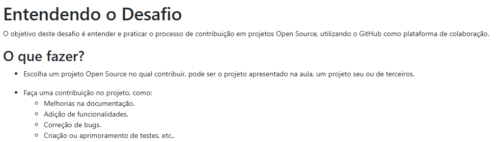

# Bootcamp Análise de Dados Randstad + Dio

📊 Descrição sobre o primeiro projeto feito no Bootcamp, cujo objetivo foi contribuir em um projeto Open Source, por meio do GitHub.

## 📕 Da descrição do projeto

Em linhas gerais, o projeto teve como principal objetivo a contribuição em um projeto da própria DIO, trazendo sugestão de melhoria em uma funcionalidade existente no [Repositório Oficial](https://github.com/digitalinnovationone/dio-lab-open-source).

Na prática, existiram duas grandes tarefas a serem realizadas nesse desafio:

1. A criação de um arquivo README.md na pasta "Community", o qual pode ser conferido neste [link](https://github.com/digitalinnovationone/dio-lab-open-source/blob/main/community/ricardo-otero12.md);
2. A [sugestão](https://github.com/digitalinnovationone/dio-lab-open-source/issues/69416) para a padronização dos commits no Guia de Contribuição do repositório.

Desta forma, o desafio foi devidamente cumprido e entregue na plataforma.

## 🛠 Ferramentas utilizadas

- **Markdown / GitHub** → Documentação e versionamento.  

## 💻 Autor / Contato

[@ricardo-otero12](https://github.com/ricardo-otero12)

Procure-me no LinkedIn: 
